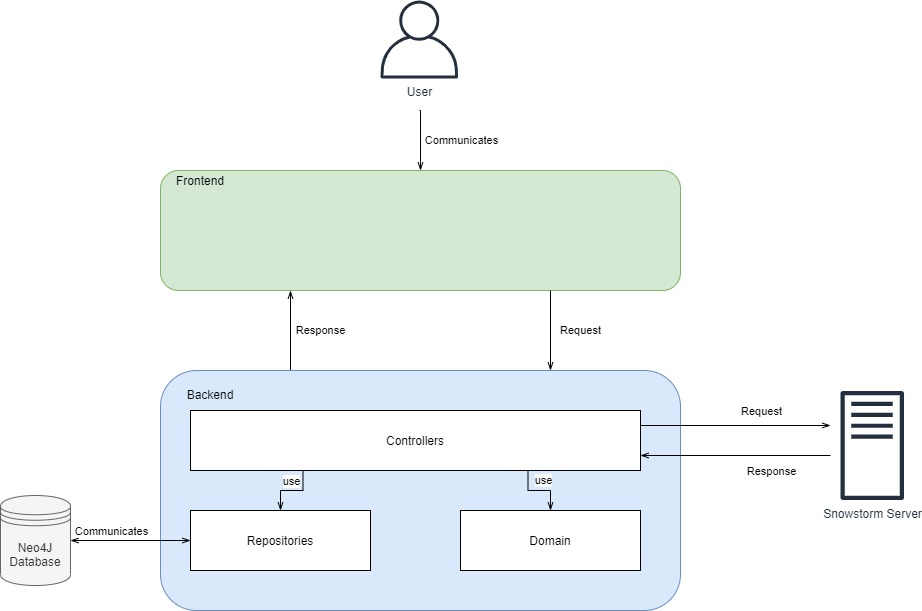

# SNOMAPP
## Introduction
The SNOMAPP application allosws users to define codemappings between APPC and SNOMED CT in a simple, fast  and intuitive way. Mappings can be persisted in the form of standardized FHIR concept maps.

### Architecture

## Application Installation and Startup
### Development Setup
SNOMAPP is a Maven-based Spring Boot application. IDE specific mechanisms must be used to load the given configuration from the top level pom.xml. Afterwards the application can be built and deployed through the standard Maven lifecycle steps.
The application binds to port 8080 per default which has to be free at startup time.

### Using Docker
Prior to the installation, Docker needs to be installed.

The application can be started with the command `docker-compose up` from the root directory of the repository. Docker subsequently resolves database dependencies and executes a full Maven build which can take several minutes the first time. As soon as the container is up and running, the application can be reached under port 8080. All persisted Data will be allocated to `./data`.

### Snowstorm Server
The IP address of the Snowstorm Server that the application should communicate with can be set with the environment variable `SNOWSTORM_ADDRESS`. To change the Server used for the Docker-Container build, the same variable needs to be set in the `docker-compose.yaml` file.
### Importing the Database
The Neo4J Database can be configured with the environment variable `spring.data.neo4j.uri`. Per default port 7678 is used. When deploying with Docker the necessary DB connections are already configured.

When starting the application for the first time, the APPC Data needs to be loaded from a CSV File inside the application. This can be done via the startpage. Afterwards the APPC tree should be displayed, and the application is ready to be used.